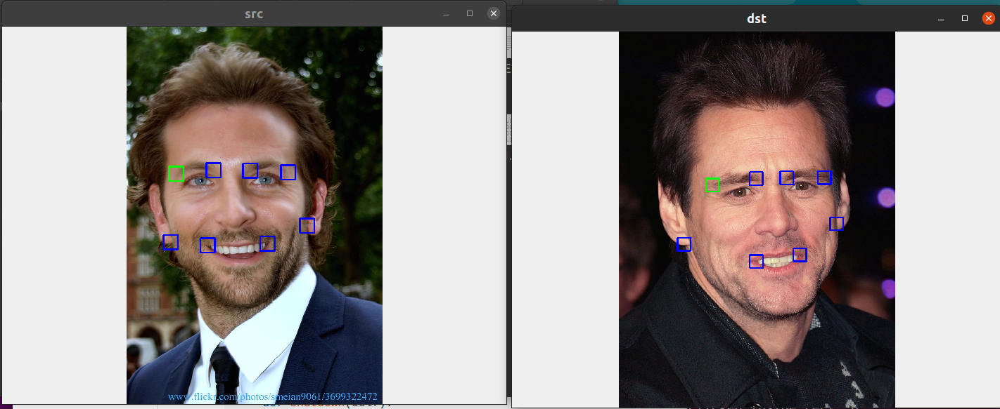
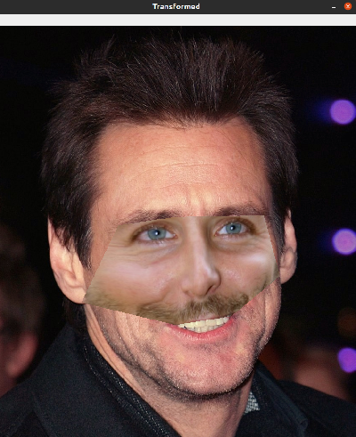
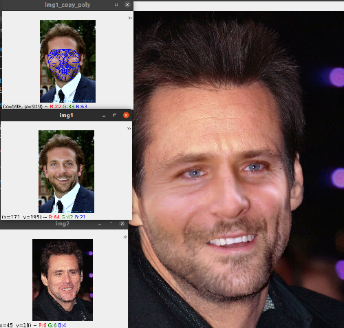

# Morph_image
Morphing fg_image and puting on top of bg_image by Delaunay triangulation and warping triangles of fg_points onto bg_points.


# Manual keypoint selection (generic)
```python3 morph_simple.py```

Click on points in source image and destination image in same order. May drag and adjust blue rects. Press ESC to quit adding points in each window. Press ESC to quit result window.





# Automatic keypoint selection (only for face)
```python3 morph_seamless.py```



# References

https://pysource.com/2019/05/28/face-swapping-explained-in-8-steps-opencv-with-python/

https://towardsdatascience.com/github-actions-makes-one-click-to-deploy-feasible-for-ml-ci-cd-pipeline-61470ed3edbc